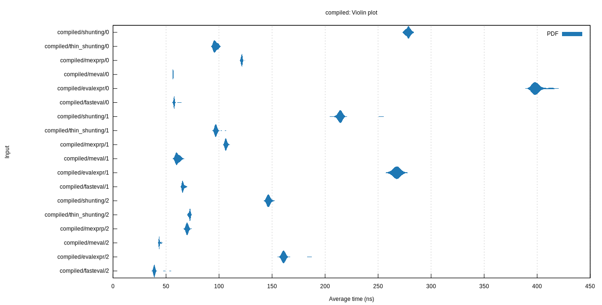

# bench-math-eval

A benchmark of math expression parsing & evaluation libraries.

```sh
cargo install cargo-criterion
cargo criterion
```

## Test cases
- arithmetic - simple +-*/
- variables - arithmetic + variable context
- compiled - pre-compiled expression + variable context

## Result

[Result](result/reports/index.html)


Winners

- arithmetic - fasteval
- variables - fasteval
- compiled - fasteval (meval comes close)

## Crates

```
             popular  note
exmex          [v] - bad context interface
shunting       [ ]
thin-shunting  [ ]
asciimath      [ ] - print things on eval
mathew         [ ]
fasteval       [v]
calculate      [ ] - doesn't compile
cpc            [ ] - doesn't compile
meval          [v] 
kalk           [v] - supports rug / bad context interface
rsc            [v] - bad context interface
evalexpr       [v]
mexprp         [ ]
```

* bad context interface = variable values are supplied with string like `eval("x = 5")` or `set_var("x", "5")`
